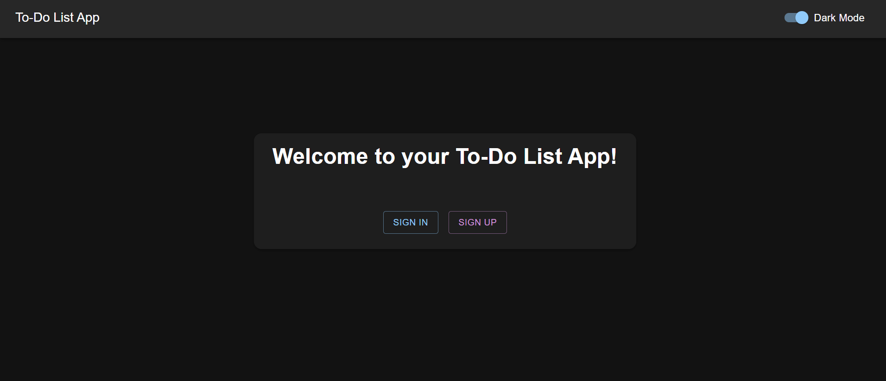
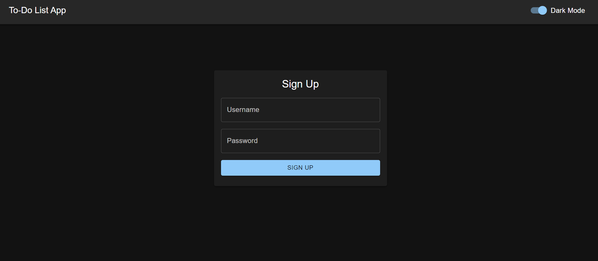
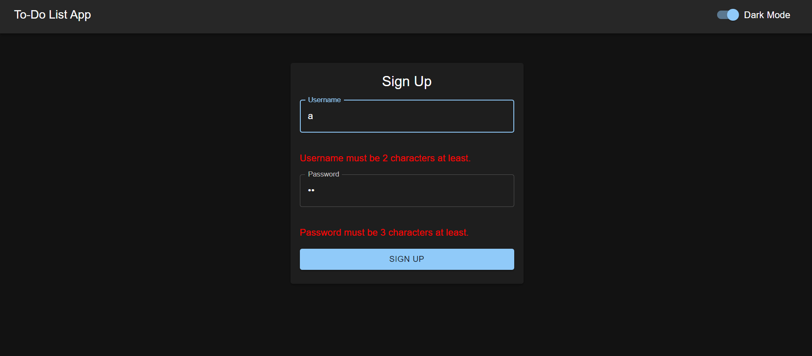
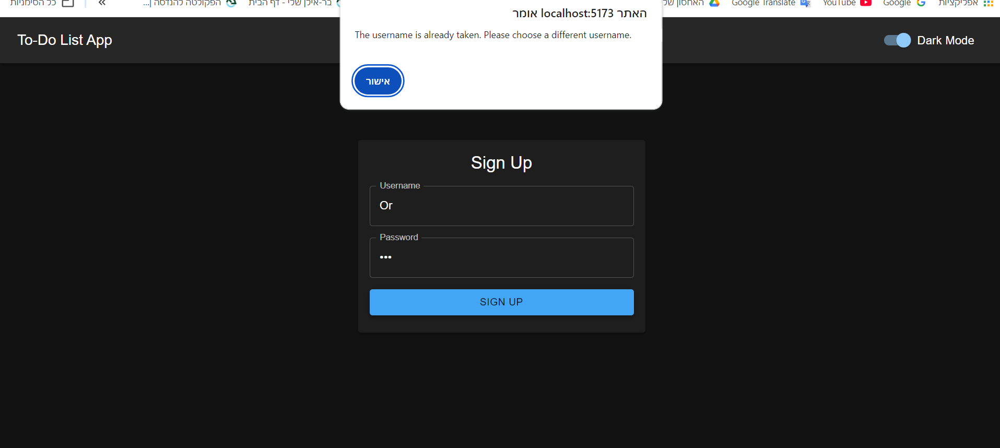
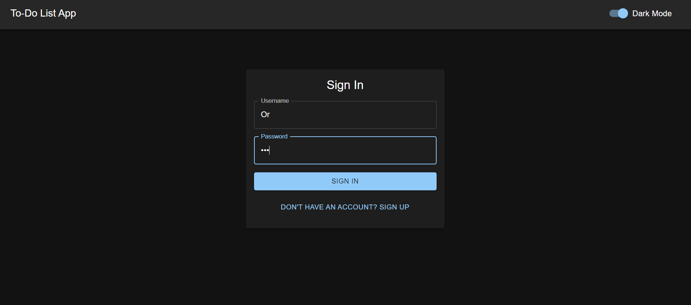
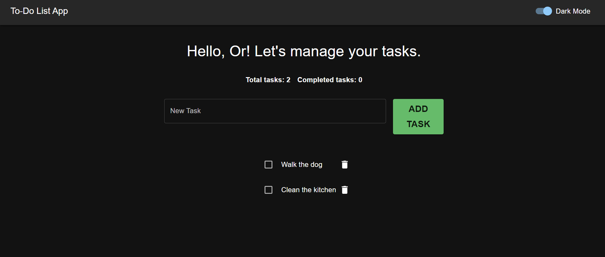
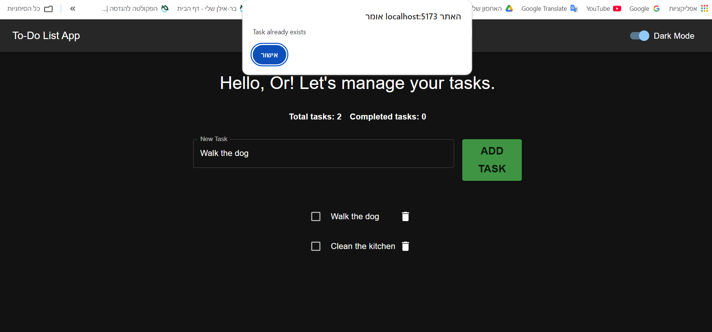

# Final-Project: To-Do List Web Application

## Description
The Final-Project is a web-based To-Do List application built with NestJS. It implements CQRS and DDD principles, ensuring scalability, maintainability, and a clean separation of concerns. The application uses Passport.js with a JWT strategy for secure user authentication and authorization. Tasks are stored in a PostgreSQL database, providing reliable and persistent data management.

## Features
- **Authentication**:
    - User login and registration using JWT tokens.
    - Secure routes protected by Passport.js and JWT strategy.

- **Task Management**:
    - Create, update, and delete tasks.
    - Mark tasks as completed or pending.
    - Retrieve tasks by user..

- **CQRS Implementation**:
    - Segregation of read and write operations with Commands, Queries, and Handlers.

- **Domain-Driven Design (DDD)**:
    - Clear domain logic and separation of layers.

- **Database Integration**:
    - Tasks are stored and managed in a PostgreSQL database.
    - Database interactions are abstracted using repositories.

- **Validation**:
    - Input validation with class-validator for data integrity.

- **Scalability**:
    - Modular architecture for future feature expansion.

## Project Structure
### Layers
1. API Layer: Defines controllers and routes for user and task operations.

2. Application Layer: Manages business logic with CQRS handlers.

3. Domain Layer: Encapsulates the core logic, entities, and repositories.

4. Infrastructure Layer: Handles database connections and external services.

### Authentication
- Passport.js: Middleware for handling authentication.

- JWT Strategy: Generates and validates access tokens for user sessions.

### CQRS and DDD Principles
**Commands and Handlers**:
    - Example: CreateTaskCommand to add a new task.

**Queries and Handlers**:
    - Example: GetTasksQuery to fetch user tasks.

**Repositories**:
    - Abstraction for database interactions (e.g., TaskRepository).


## Table of Contents
- [Description](#Description)
- [Features](#features)
- [Project Structure](#Project-Structure)
- [Setup and Installation](#Setup-and-Installation)
- [Usage](#Usage)
- [Technologies Used](#Technologies-Used)
- [Screenshots](#screenshots)
- [Future Improvements](#Future-Improvements)
- [Contact Information](#Contact-Information)

## Setup and Installation
Follow these steps to set up the project locally:
1. Clone the repository: 
    ```
    git clone https://github.com/OrBenNaim/Army-Training-Program.git
    ```

2. Navigate to the Final-Project directory:
    ```
    cd Army-Training-Program/Final-Project
    ```

3. Set up your .env file in the Final-Project directory:
    - Use the .env.example file

4. Start the application using Docker Compose:
    ```
    docker-compose up
    ```
    Start the entire project using 'docker-compose up' command.
    This will build and run the frontend, backend, and PostgreSQL database containers.

    Docker Compose will handle:

    Starting the PostgreSQL container on port 5433.
    Starting the Backend (NestJS) service on port 3000.
    Starting the Frontend (React) service on port 5173.

5. Once the containers are up and running, access the frontend at:
    ```
    http://localhost:5173
    ```

## Usage
### Endpoints
1. **Authentication**:
    - Register: POST /auth/register
        - Request Body:
            {
                "username": "example",
                "password": "password123"
            }

    - Login: POST /auth/login
        - Response: Returns a JWT token.

2. **Task Management**:
    - Create Task: POST /tasks
        - Requires authentication.
            - Request Body:
                {
                    "title": "Sample Task",
                    "description": "Task details"
                }

    - Get Tasks: GET /tasks
        - Retrieves tasks for the authenticated user.
    
    - Update Task: PUT /tasks
    
    - Delete Task: DELETE /tasks

## Technologies Used
- NestJS: A progressive Node.js framework for building scalable applications.

- Passport.js: Authentication middleware with JWT strategy.

- PostgreSQL: Relational database for persistent storage.

- Axios: A promise-based HTTP client for making external API requests.

- TypeScript: Ensures type safety and maintainable code.

- CQRS Module: Segregates command and query logic.

- Class-Validator: Validates incoming request data.

## Future Improvements
- Add user roles for task sharing and collaboration.

- Implement task prioritization and deadlines.

- Introduce pagination for task lists.

- Add unit tests for commands, queries, and handlers.

## Screenshots
### Home Page


### Sign-Up Page


### Sign-Up Error Credentials


### Sign-Up Username Error


### Sign-In Page


### Tasks Page


### Tasks Page Error



## Contact Information
- GitHub: OrBenNaim
- Email: orbennaim123@gmail.com
- LinkedIn: www.linkedin.com/in/or-ben-naim-eee


