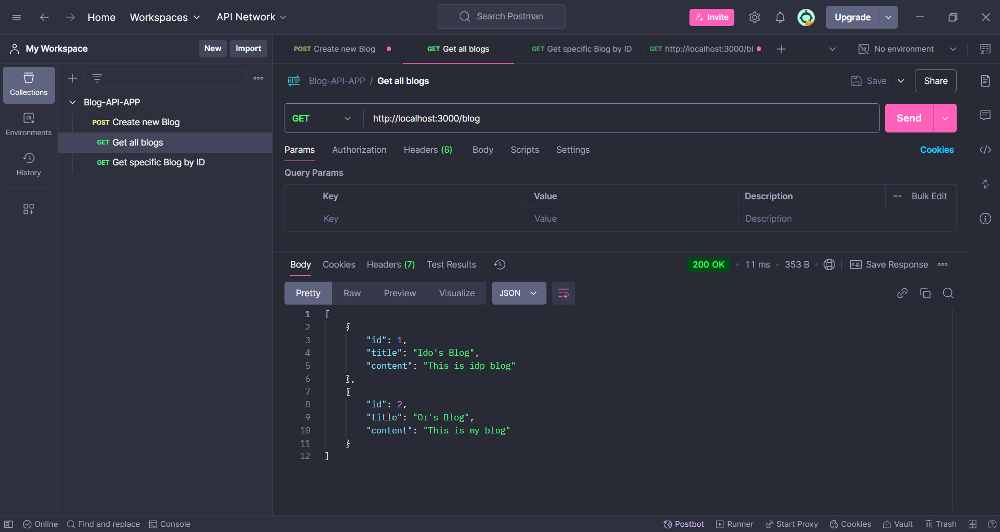

# Blog-API-App-V1

## Description
Blog-API-App is a NestJS-based RESTful API for managing a blog. The application allows users to create, retrieve, update, and delete blog posts. It also integrates with external APIs using Axios to enhance functionality, such as fetching Chuck Norris jokes and customizing them. This project is designed with modularity and scalability in mind, making it a great foundation for learning and building server-side applications.

## Features
- **Create Blog Post**: Add new blog entries with a title and content.
- **Retrieve All Blog Posts**: Get a list of all blog entries.
- **Retrieve Specific Blog Post**:  Fetch a specific blog by its ID.
- **Fetch and Customize Jokes**: Fetch Chuck Norris jokes from an external API and replace "Chuck Norris" with "Bublil".
- **Validation**: Uses class-validator to ensure input data integrity.

## Table of Contents
- [Features](#features)
- [Setup and Installation](#setup-and-installation)
- [Usage](#usage)
- [Technologies Used](#technologies-used)
- [Screenshots](#screenshots)
- [Future Improvements](#future-improvements)
- [Contact Information](#contact-information)

## Setup and Installation
Follow these steps to set up the project locally:
1. Clone the repository: 
    git clone https://github.com/OrBenNaim/Army-Training-Program.git

2. Navigate to the Blog-API-App directory:
    cd Army-Training-Program/Nest-Projects/blog-api-app-v1

3. Install the dependencies:
    npm install

4. Start the development server:
    npm run start:dev

5. Open your browser or Postman and interact with the API endpoints at:
    http://localhost:3000

## Usage
1. Create a Blog
  - Endpoint: POST /blog
  - Request Body:
    {
      "title": "Sample Title",
      "content": "Sample Content"
    }
  - Response: Returns the created blog entry.

2. Get All Blogs
  - Endpoint: GET /blog
  - Response: Returns a list of all blog entries.

3. Get Blog by ID
  - Endpoint: GET /blog/:id
  - Example: GET /blog/1
  - Response: Returns the blog entry with the specified ID.

4. Fetch Customized Jokes
  - Endpoint: GET /blog/jokes/bublil
  - Response: Logs a joke with "Chuck Norris" replaced by "Bublil".

## Technologies Used
- NestJS: A progressive Node.js framework for building efficient server-side applications.

- Axios: A promise-based HTTP client for making external API requests.

- Class-Validator: Ensures input validation for incoming requests.

- TypeScript: Provides type safety and enhances code maintainability. 

## Future Improvements
- Database Integration: Replace in-memory storage with a database like PostgreSQL or MongoDB.

- Authentication and Authorization: Add user authentication and role-based access control.

- Pagination: Implement pagination for large datasets.

- Unit Testing: Write tests for controllers and services.

## Screenshots
### Post Blog

### Get All Blogs

### Get Specific Blog By Id

### Get Joke

## Contact Information
- GitHub: OrBenNaim
- Email: orbennaim123@gmail.com
- LinkedIn: linkedin.com/in/or-ben-naim-eee