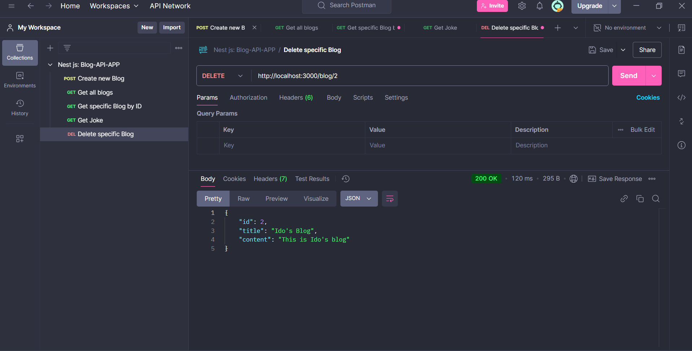

# Blog-API-App-V2

## Description
Blog-API-App-V2 is a backend application built with NestJS, focused on efficient interaction with PostgreSQL databases using Drizzle ORM. The project demonstrates how to build a scalable and modular RESTful API with a clean codebase. It includes CRUD operations for managing blog posts and showcases robust database integration using PostgreSQL and Drizzle ORM. This application serves as an excellent starting point for developers seeking to work with relational databases in a TypeScript-based server environment.

## Features
- **Database Integration**: Utilizes PostgreSQL for persistent data storage.
- **Drizzle ORM**: Simplifies database queries and operations with a lightweight and type-safe ORM.
- **Create Blog Post**: Add new blog entries with a title and content.
- **Retrieve All Blog Posts**: Get a list of all blog entries.
- **Retrieve Specific Blog Post**:  Fetch a specific blog by its ID.
- **Update Blog Post**: Edit existing blog entries.
- **Delete Blog Post**: Remove specific blog entries from the database.
- **Fetch and Customize Jokes**: Fetch Chuck Norris jokes from an external API and replace "Chuck Norris" with "Bublil".
- **Validation**: Uses class-validator to ensure input data integrity.

## Table of Contents
- [Features](#features)
- [Setup and Installation](#setup-and-installation)
- [Usage](#usage)
- [Technologies Used](#technologies-used)
- [Screenshots](#screenshots)
- [Future Improvements](#future-improvements)
- [Contact Information](#contact-information)

## Setup and Installation
Follow these steps to set up the project locally:
1. Clone the repository: 
    git clone https://github.com/OrBenNaim/Army-Training-Program.git

2. Navigate to the Blog-API-App directory:
    cd Army-Training-Program/Nest-Projects/blog-api-app-v2

3. Install the dependencies:
    npm install

4. Set up the database:
    - Ensure PostgreSQL is installed and running.
    - Create a database named blog_db.
    - Update the .env file with the database connection details:
      DATABASE_HOST=localhost
      DATABASE_PORT=5432
      DATABASE_USER=your_username
      DATABASE_PASSWORD=your_password
      DATABASE_NAME=blog_db

5. Run database migrations:
    npm run migrate

6. Start the development server:
    npm run start:dev

7. Open your browser or Postman and interact with the API endpoints at:
    http://localhost:3000

## Usage
1. Create a Blog
  - Endpoint: POST /blog
  - Request Body:
    {
      "title": "Sample Title",
      "content": "Sample Content"
    }
  - Response: Returns the created blog entry.

2. Get All Blogs
  - Endpoint: GET /blog
  - Response: Returns a list of all blog entries.

3. Get Blog by ID
  - Endpoint: GET /blog/:id
  - Example: GET /blog/1
  - Response: Returns the blog entry with the specified ID.

4. Delete Blog Post
  - Endpoint: DELETE /blogs/:id
  - Example: DELETE /blogs/1
  - Response: Confirms the deletion.

5. Fetch Customized Jokes
  - Endpoint: GET /blog/jokes/bublil
  - Response: Logs a joke with "Chuck Norris" replaced by "Bublil".

## Technologies Used
- NestJS: A progressive Node.js framework for building efficient server-side applications.

- Drizzle ORM: A lightweight TypeScript ORM for clean and type-safe interaction with PostgreSQL.

- PostgreSQL: A robust and reliable relational database system.

- Axios: A promise-based HTTP client for making external API requests.

- Class-Validator: Ensures input validation for incoming requests.

- TypeScript: Provides type safety and enhances code maintainability. 

## Future Improvements
- Advanced Querying: Add support for complex queries, such as filtering and sorting.

- Authentication and Authorization: Add user authentication and role-based access control.

- Pagination: Implement pagination for large datasets.

- Unit Testing: Write tests for controllers and services.

## Screenshots
### Post Blog

### Get All Blogs

### Get Specific Blog By Id

### Delete Specific Blog By Id

### Delete Specific Blog By Unexistable Id

### Get Joke

## Contact Information
- GitHub: OrBenNaim
- Email: orbennaim123@gmail.com
- LinkedIn: linkedin.com/in/or-ben-naim-eee