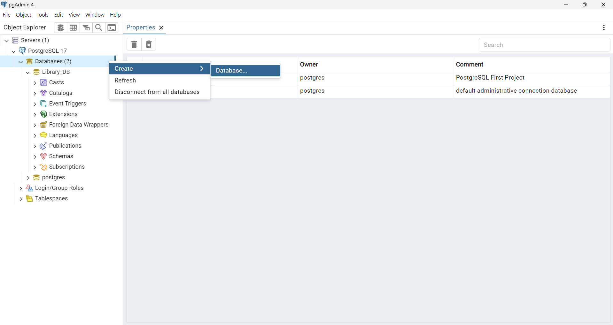

# Library DB - PostgreSQL Project

## Description
Library-DB is a PostgreSQL-based database project designed to manage a library system. The project includes comprehensive tables and queries for handling books, authors, borrowers, and loans. Key features include tracking book loans, managing borrower information, and identifying overdue or currently loaned books.

## Features
- **Authors Management**: Store details about authors, including their name and biography.
- **Books Management**: Track book titles, their authors, publishers, and publication dates.
- **Borrower Management**: Maintain a list of library borrowers with their names and contact details.
- **Loan Management**: Record book loans, including loan and return dates.
Cascade Deletion: Automatically delete associated records (e.g., loans) when an author or book is removed.
- **Query Examples**:
    - List all books by a specific author.
    - Find borrowers of a specific book.
    - Identify overdue loans.
    - Track all books currently on loan.

## Table of Contents
- [Features](#features)
- [Setup and Installation](#setup-and-installation)
- [Usage](#usage)
- [Technologies Used](#technologies-used)
- [Future Improvements](#future-improvements)
- [Screenshots](#screenshots)
- [Contact Information](#contact-information)

## Setup and Installation
Follow these steps to set up the database:

1. Clone the repository:
    git clone https://github.com/OrBenNaim/Army-Training-Program/PostgreSQL-Projects.git

2. Navigate to the project directory:
    cd Library_DB

3. Launch pgAdmin or your preferred PostgreSQL tool.

4. Follow the next steps to creating a new DB:

5. ### Click on the arrow next to 'Servers'

6. ### Right click on 'Databases' and then  click on 'Create' and then click on 'Database...'

7. ### Choose a name for your database and click on the 'save' button

8. ### Click on the 'Query Tool' icon

9. ### Click on the 'Open File' icon

10. Go to the src folder and select the file createTables.sql for creating the necessary tables.

11. ### Click on the 'Execute script' button 

12. Repeat on stages 8 and 9 and then selects the file 'insertData.sql' from the src folder.

13. Repeat on stage 11

14. Your DB is ready.
To see the data in tables itself, open the file 'showTables.sql' from the src folder (as you did in stages 8 and 9) and then run it (as you did in stages 8 and 11).

## Usage
1. Run Queries: Use the provided queries in queries.sql to perform tasks such as:
    - List books by an author.
    - Find overdue loans.
    - Track currently loaned books.
2. Insert Data: Add new authors, books, borrowers, and loans using custom INSERT statements.
3. Update Data: Modify existing records with UPDATE commands for scenarios like changing borrower details.
4. Delete Data: Remove records using DELETE commands while maintaining referential integrity.

## Technologies Used
- PostgreSQL: Robust relational database system.
- pgAdmin: PostgreSQL management and administration GUI.
- VS Code: Used with PostgreSQL extensions for managing and querying the database.

## Future Improvements
- Advanced Search: Add advanced filters for books (e.g., by genre or year).
- Overdue Notifications: Integrate email notifications for overdue loans.
- Analytics: Generate reports for popular books or active borrowe

## Screenshots
### DB Diagram

### Authors Table

### Books Table

### Borrowers Table

### Loans Table

### By Specific Author

### Brrowers By Specific Book

### Books That Currently On Loan

### Books That Are Overdue

## Contact Information
- GitHub: OrBenNaim
- Email: orbennaim123@gmail.com
- LinkedIn: linkedin.com/in/or-ben-naim-eee