# Online Store DB - PostgreSQL Project

## Description
The Online Store DB is a PostgreSQL-based database project designed to manage an online store. The project includes comprehensive tables and queries for handling products, customers, orders, inventory, and order items. Key features include tracking customer orders, managing product inventory, and ensuring smooth sales operations.

## Features
- **Customer  Management**: Store details about customers, including their name, email, and password.
- **Product  Management**: Track products, their descriptions, prices, and categories.
- **Order Items Management**: Keep track of items within each order, including quantity and subtotal.
- **Inventory  Management**: Monitor product stock levels and manage inventory accordingly.
Cascade Deletion: Automatically delete associated records (e.g., order items) when an order or product is removed.
- **Query Examples**:
    - List all orders placed by a specific customer.
    - Identify out-of-stock products.
    - Calculate total revenue from all orders.
    - Track all products currently out of stock.

## Table of Contents
- [Features](#features)
- [Setup and Installation](#setup-and-installation)
- [Usage](#usage)
- [Technologies Used](#technologies-used)
- [Future Improvements](#future-improvements)
- [Screenshots](#screenshots)
- [Contact Information](#contact-information)

## Setup and Installation
Follow these steps to set up the database:

1. Clone the repository:
    git clone https://github.com/OrBenNaim/Army-Training-Program/PostgreSQL-Projects.git

2. Navigate to the project directory:
    cd Online_Store_DB

3. Launch pgAdmin or your preferred PostgreSQL tool.

4. Follow the next steps to creating a new DB:

5. ### Click on the arrow next to 'Servers'

6. ### Right click on 'Databases' and then  click on 'Create' and then click on 'Database...'

7. ### Choose a name for your database and click on the 'save' button

8. ### Click on the 'Query Tool' icon
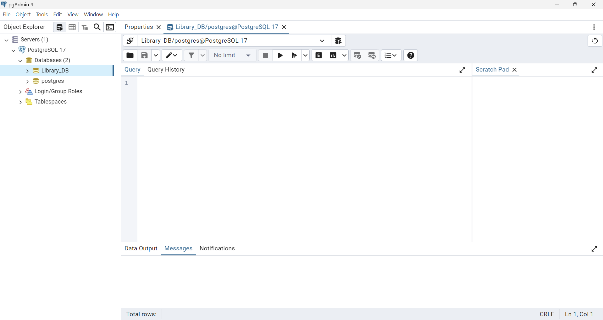

9. ### Click on the 'Open File' icon

10. Go to the src folder and select the file createTables.sql for creating the necessary tables.

11. ### Click on the 'Execute script' button 
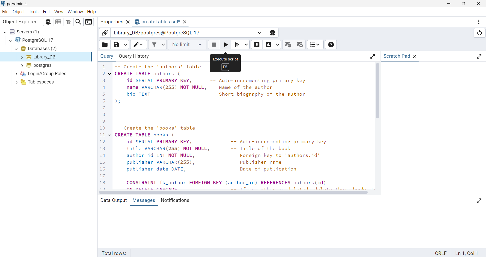

12. Repeat on stages 8 and 9 and then selects the file 'insertData.sql' from the src folder.

13. Repeat on stage 11

14. Your DB is ready.
To see the data in tables itself, open the file 'showTables.sql' from the src folder (as you did in stages 8 and 9) and then run it (as you did in stages 8 and 11).

## Usage
1. Run Queries: Use the provided queries in queries.sql to perform tasks such as:
    - List orders by a specific customer.
    - Find out-of-stock products.
    - Calculate the total revenue.
    - Track orders by date.
2. Insert Data: Add new customers, products, and orders using custom INSERT statements.
3. Update Data: Modify existing records with UPDATE commands for scenarios like changing customer details or updating product prices.
4. Delete Data: Remove records using DELETE commands while maintaining referential integrity.

## Technologies Used
- PostgreSQL: Robust relational database system.
- pgAdmin: PostgreSQL management and administration GUI.
- VS Code: Used with PostgreSQL extensions for managing and querying the database.

## Future Improvements
- Advanced Search: Add advanced filters for products, such as by category or price range.
- Overdue Notifications: Integrate email notifications for new orders or inventory updates.
- Analytics: Generate reports on sales trends or customer purchasing behaviors.

## Screenshots
### DB Diagram
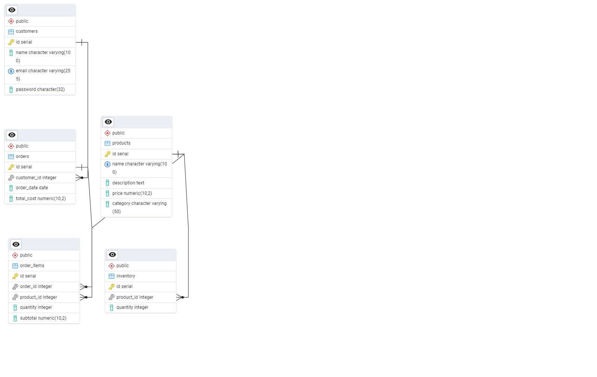

### Products Table
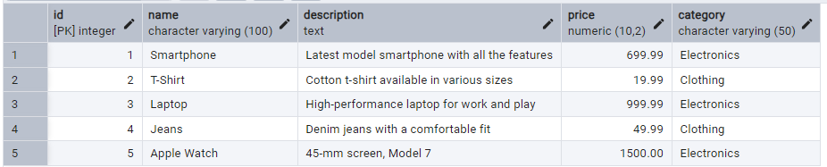

### Customers Table
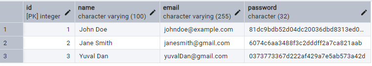

### Orders Table
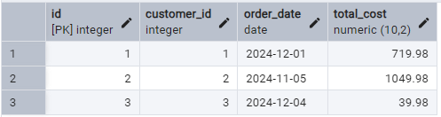

### Order Items Table
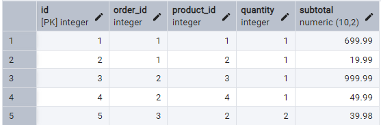

### Inventory Table
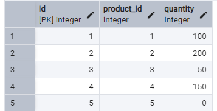

### Orders By Specific Customer
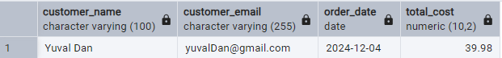

### Products By Specific Category
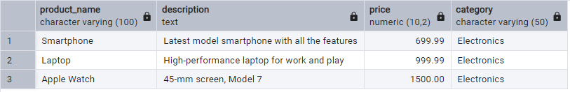

### Products That Are Currently Out Of Stock
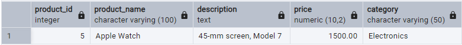

### Total Reveneu By The Online Store
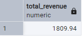

### Average Order Value
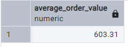

## Contact Information
- GitHub: OrBenNaim
- Email: orbennaim123@gmail.com
- LinkedIn: linkedin.com/in/or-ben-naim-eee