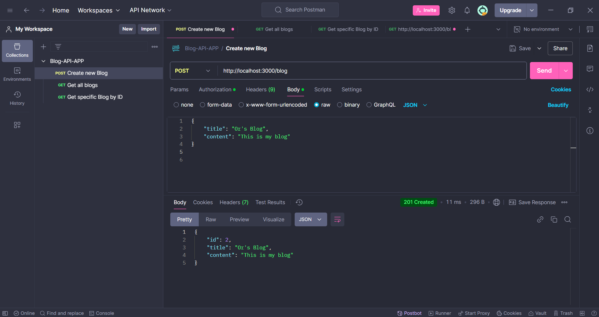
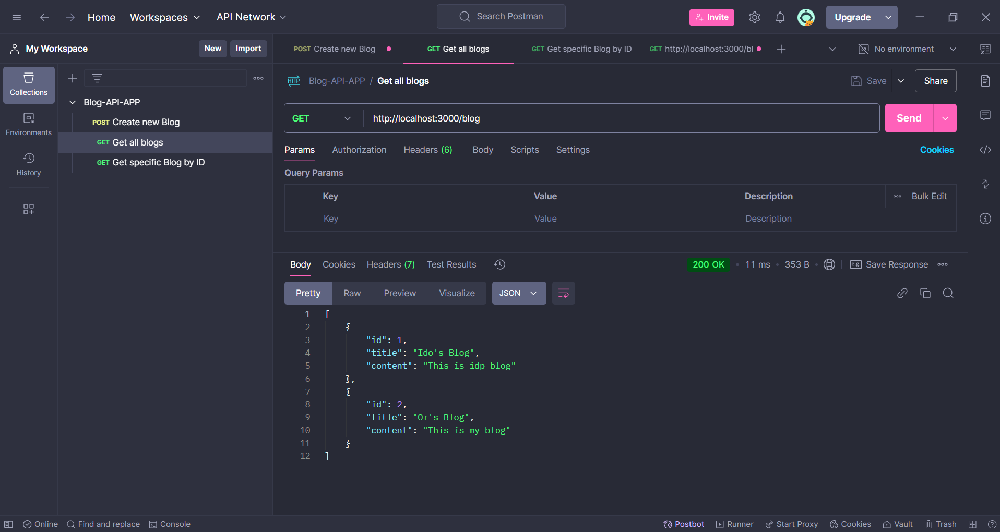
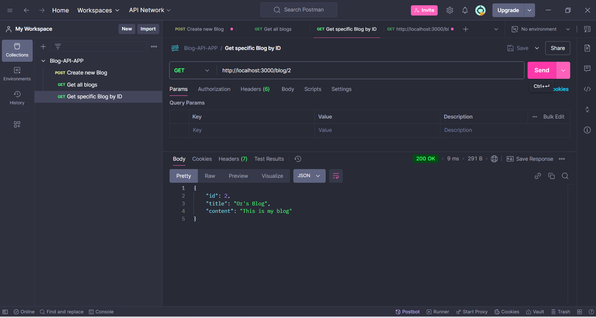
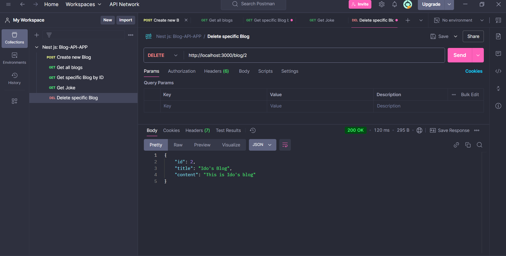
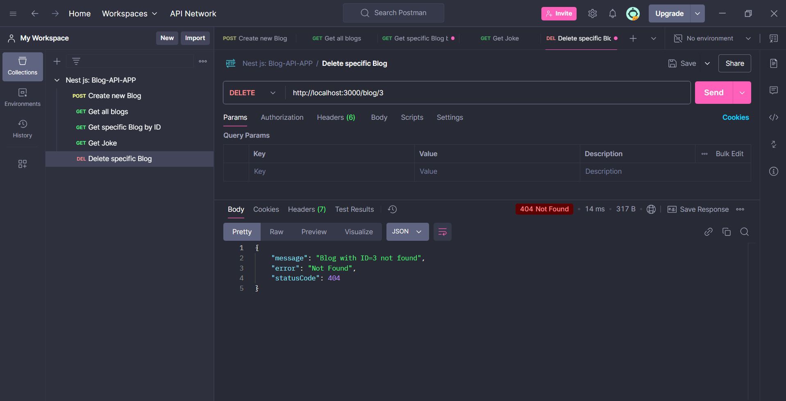
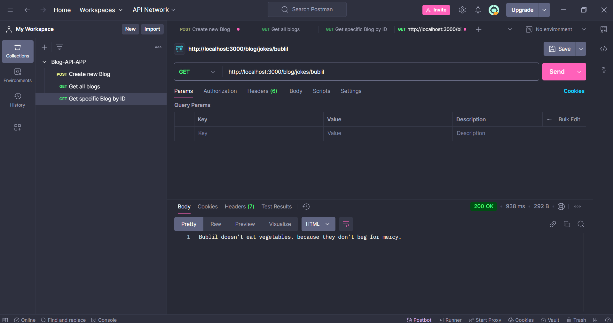

# Blog-API-App-V3

## Description
Blog-API-App-v3 is a backend application built with NestJS, implementing CQRS and DDD principles for scalability, maintainability, and modularity. The project interacts with a PostgreSQL database using Drizzle ORM and provides a structured approach to building RESTful APIs with a clean separation of concerns. It supports CRUD operations for managing blog posts and demonstrates how to design an application with modern architectural patterns like CQRS and DDD.

## Features
- **CQRS Implementation**: Separates read and write operations with Commands, Queries, and their respective Handlers.
- **DDD Principles**: Implements domain-driven design with clear domain logic, repository patterns, and separation of concerns.
- **Database Integration**: Utilizes PostgreSQL for persistent data storage.
- **Drizzle ORM**: Simplifies database queries and operations with a lightweight and type-safe ORM.
- **Create Blog Post**: Add new blog entries with a title and content.
- **Retrieve All Blog Posts**: Get a list of all blog entries.
- **Retrieve Specific Blog Post**:  Fetch a specific blog by its ID.
- **Delete Blog Post**: Remove specific blog entries from the database.
- **Fetch and Customize Jokes**: Fetch Chuck Norris jokes from an external API and replace "Chuck Norris" with "Bublil".
- **Validation**: Uses class-validator to ensure input data integrity.

## CQRS and DDD Principles
### Command Query Responsibility Segregation (CQRS)
  1. Commands:
    - Responsible for state-changing operations.
    - Example: CreateBlogCommand is used to add a new blog post.

  2. Queries:
    - Handle read-only operations.
    - Example: GetAllBlogsQuery fetches all blog entries.

  3. Handlers:
    - Separate command and query logic to simplify workflows and improve scalability.
    - Example: CreateBlogHandler processes the CreateBlogCommand by interacting with the domain and repository layers.

### Domain-Driven Design (DDD)
  1. Domain Layer:
    - Encapsulates business rules and logic.
    - Example: The Blog entity defines the core attributes and behaviors of a blog post.

  2. Repository Pattern:
    - Abstracts data persistence logic.
    - Example: DrizzleBlogRepository interacts with the database and implements the BlogRepository interface.

  3. Separation of Concerns:
    - Divides the application into distinct layers (API, Application, Domain, and Infrastructure) to ensure maintainability and scalability.

  4. Ubiquitous Language:
    - Defines a shared language for domain concepts (e.g., Blog, Command, Query), ensuring clarity across teams.

## Table of Contents
- [Features](#features)
- [CQRS and DDD Principles](#CQRS-and-DDD-Principles)
- [Setup and Installation](#setup-and-installation)
- [Usage](#usage)
- [Technologies Used](#technologies-used)
- [Screenshots](#screenshots)
- [Future Improvements](#future-improvements)
- [Contact Information](#contact-information)

## Setup and Installation
Follow these steps to set up the project locally:
1. Clone the repository: 
    git clone https://github.com/OrBenNaim/Army-Training-Program.git

2. Navigate to the Blog-API-App directory:
    cd Army-Training-Program/Nest-Projects/blog-api-app-v3

3. Install the dependencies:
    npm install

4. Set up the database:
    - Ensure PostgreSQL is installed and running.
    - Create a database named blog_db.
    - Update the .env file with the database connection details:
      DATABASE_HOST=localhost
      DATABASE_PORT=5432
      DATABASE_USER=your_username
      DATABASE_PASSWORD=your_password
      DATABASE_NAME=blog_db

5. Run database migrations:
    npm run migrate

6. Start the development server:
    npm run start:dev

7. Open your browser or Postman and interact with the API endpoints at:
    http://localhost:3000

## Usage
1. Create a Blog
  - Endpoint: POST /blog
  - Request Body:
    {
      "title": "Sample Title",
      "content": "Sample Content"
    }
  - Response: Returns the created blog entry.

2. Get All Blogs
  - Endpoint: GET /blog
  - Response: Returns a list of all blog entries.

3. Get Blog by ID
  - Endpoint: GET /blog/:id
  - Example: GET /blog/1
  - Response: Returns the blog entry with the specified ID.

4. Delete Blog Post
  - Endpoint: DELETE /blog/:id
  - Example: DELETE /blog/1
  - Response: Confirms the deletion.

5. Delete All Blogs
  - Endpoint: DELETE /blog
  - Example: DELETE /blog
  - Response: Confirms the deletion.

6. Fetch Customized Jokes
  - Endpoint: GET /blog/jokes/bublil
  - Response: Logs a joke with "Chuck Norris" replaced by "Bublil".

## Technologies Used
- NestJS: A progressive Node.js framework for building efficient server-side applications.

- Drizzle ORM: A lightweight TypeScript ORM for clean and type-safe interaction with PostgreSQL.

- CQRS Module: Segregates commands and queries for better scalability.

- PostgreSQL: A robust and reliable relational database system.

- Axios: A promise-based HTTP client for making external API requests.

- Class-Validator: Ensures input validation for incoming requests.

- TypeScript: Provides type safety and enhances code maintainability. 

## Future Improvements
- Advanced Querying: Add support for complex queries, such as filtering and sorting.

- Authentication and Authorization: Add user authentication and role-based access control.

- Pagination: Implement pagination for large datasets.

- Unit Testing: Write tests for controllers and services.

## Screenshots
### Post Blog

### Get All Blogs

### Get Specific Blog By Id

### Delete Specific Blog By Id

### Delete Specific Blog By Unexistable Id

### Get Joke

## Contact Information
- GitHub: OrBenNaim
- Email: orbennaim123@gmail.com
- LinkedIn: linkedin.com/in/or-ben-naim-eee